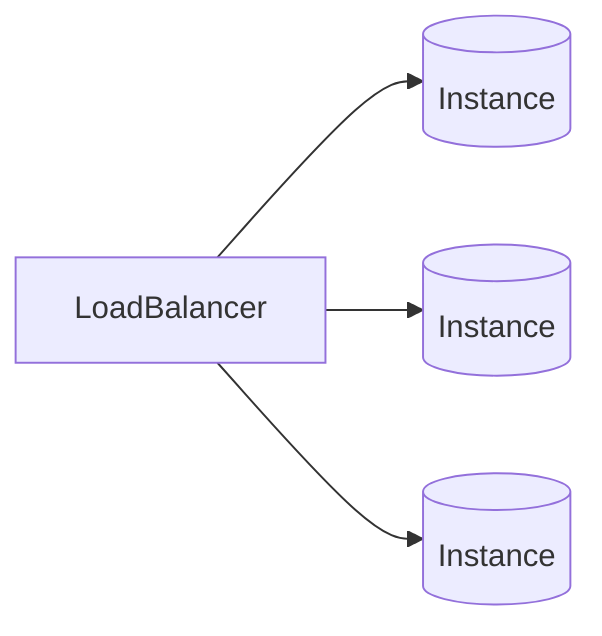

# AWS 스터디 2일차 06/26

## 스터디 주제
	AWS 컴퓨팅 서비스에 대해 알아보자.

## [공식문서읽기]

### EC2
>  AWS의 거의 모든 서비스는 EC2에서 돌아간다!

##### 인스턴스 유형
- 온디맨드: 처음에 기본으로 선택하는 유형.
- 예약: 온디맨드로 사용하다가 오랫동안 쭉 쓸것 같다 라고 하면 예약 인스턴스로 전환해서 요금을 매우 절약할 수 있다.
- 스팟: 배치잡 처럼, 한번 띄워서 단발성으로 작업하고 죽는 인스턴스 유형이다. 하지만 스팟 인스턴스는 언제 죽을지 모른다. AWS IDC에서 스팟 인스턴스에 대한 단일 컴퓨팅 자원을 보장 하지 않는다. 오토스케일링으로 확장된 온디맨드 혹은 예약 인스턴스가 스팟인스턴스의 영역을 침범할 수 있기 때문이다.

##### EC2 콘솔 같이 보기
> 콘솔 메뉴들 중 Instance 하위 메뉴를 잘 기억하자!

- Launch Template
	EC2인스턴스를 생성하기 전에 어떤 작업을 할 것인가를 설정한다(프로비저닝). 일종의 작업 명세서
- 그외 나머지 인스턴스 유형별 **메뉴들**..

### Auto Scailing
EC2인스턴스를 자동으로 추가하거나 제거하는 사용자 설정. 원하는 개수, 최소&최대 개수 설정별 트리거(*ex: cpu 사용률이 70%이상이면 EC2하나 추가*)가 있다. AWS 아키텍쳐는 수평확장 가능을 원칙으로 하기 때문에 EC2 인스턴스를 생성할 때, AutoScailing을 꼭 걸자.
> 서비스 트래픽 증가시 서버 리소스를 **수평확장** 하기 위해 AutoScailing은 필수! 

### Image Builder
EC2 launch templte에서 하지못하는 os레벨 설정을 하는 곳. iso이미지 굽는 것과 동일한 기능을 한다. 
>용진님은 hashcorp사의 [packer]을 사용한다. 

### Lightsail
카페24 호스팅 같은 제품

### App Runner
컨테이너 기반으로 어플리게이션을 배포하게 해주는 도구. 심플하게 구성하기 좋아서 토이프로젝트나 간단 외주 작업에 주로 사용한다.

### Batch
TB급 작업을 한방에 실행하는데 사용한다. 어플리케이션 보다는 머신러닝 분야에서 주로 활용한다.

### Elastic Beanstalk
대형회사에서 조그마한 신규 프로젝트를 할때 많이 사용한다고 한다.

### Fargate(퐈-게이트)
AWS ECS를 위한 컴퓨팅 엔진으로, 컨테이너를 실행 할 수 있는 EC2이다. EC2를 구성하지 않고 AWS에서 관리하는 EC2풀에서 사용자만을 위한 공간을 할당받는다.

### Lambda
아키텍쳐 구성 중에 작은 기능 작업들을 Lambda로 만들어서 중간에 블럭코딩 하듯이 끼워넣는데 사용한다. 이 외에도 아주 다양하게 활용할 수 있고, 따로 섹션을 만들어서 다룰 예정입니다.

[packer]:https://www.packer.io/
[공식문서읽기]:https://docs.aws.amazon.com/ko_kr/whitepapers/latest/aws-overview/compute-services.html
